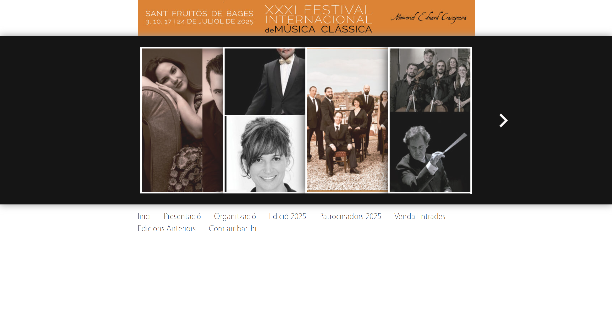

# Festival Sant Fruitós de Bages

[](https://github.com/Festival-Sant-Fruitos/website/actions/workflows/ci.yml)
[](.nvmrc)
[](https://nextjs.org)
[](https://react.dev)
[](https://tailwindcss.com)
[](tsconfig.json)

Production website for the XXXII Festival Internacional de Música Clàssica de Sant Fruitós de Bages, a 30+ year classical music festival held at Món Sant Benet monastery in Catalonia.

Live site: [festivalsantfruitos.com](https://www.festivalsantfruitos.com)

Full rebuild from the legacy WordPress site to a statically exported Next.js application. Goal: faster load times, modern design, accessible interactions, and a safe pipeline so content updates do not risk breaking the site before a festival date.

---

## Before and after

The previous WordPress site was a dated, template driven design with no real hierarchy, poor responsive behaviour, and no SEO or accessibility work.

### Legacy WordPress site




### Current version

Live at [festivalsantfruitos.com](https://www.festivalsantfruitos.com). See the home page, `/programa`, and `/historia` for the redesign.

---

## Tech stack

| Area | Choice |
|---|---|
| Framework | Next.js 16.1.6 (App Router, static export) |
| UI | React 19.2.3, TypeScript 5 (strict) |
| Styling | Tailwind CSS 4 with CSS first config via `@theme` in `globals.css` |
| Animation | Framer Motion (`motion` 12.35.2) with `useReducedMotion` support |
| Components | shadcn (base-nova style), Base UI, Embla Carousel, Lucide icons |
| Testing | Playwright 1.58.2 on Chromium and WebKit |
| Lint / types | ESLint 9 (flat config, `next/core-web-vitals` + `typescript`) and `tsc --noEmit` |
| Runtime | Node 22 pinned via `.nvmrc` |

No JavaScript Tailwind config exists. Everything is CSS first using the v4 `@theme` block, with custom color, font, and spacing tokens defined in `src/app/globals.css`.

---

## What is built

All user facing copy is in Catalan.

**Pages** (`src/app/`)
- `/` Home with hero, program preview, venue, legacy stats counter, sponsors
- `/programa` Full concert schedule with artist images, repertoire, prices, and download links for triptych PDF and poster
- `/entrades` Tickets with pricing, FAQ accordion, rain plan and accessibility info
- `/historia` Festival history narrative since 1995
- `/historia/[year]` Dynamic per edition archive pages with concert details and milestones
- `/ubicacio` Venue page with embedded map and rain venue
- `/patrocinadors`, `/sobre`, `/avis-legal`
- Custom `not-found.tsx` and `error.tsx`

**Features**
- Animated number counters for festival stats (editions, concerts, years, artists) with spring physics
- Scroll triggered blur and fade reveals, skipped automatically for users with `prefers-reduced-motion`
- Sticky header that turns opaque after 20px of scroll
- Mobile hamburger menu
- Embla based carousels for featured artists
- Custom cookie consent with versioned local storage and a 1 year expiry, reopenable via a footer link
- JSON LD structured data (`MusicFestival` schema) for rich search results
- OpenGraph and Twitter card metadata per page, dynamic canonical URLs
- Dynamic `sitemap.ts` and `robots.txt`
- Web manifest for PWA install

**Edition switching**

The festival changes every year. Instead of hard coding content, each year lives in `src/data/editions/{year}.json` behind a typed `Edition` interface (`src/types/festival.ts`). The active year is chosen by the `NEXT_PUBLIC_FESTIVAL_EDITION` environment variable. A `"revealed"` boolean in the JSON gates the program between a public teaser and the full schedule, so the site can be built and deployed well before the lineup is public and then flipped on with a single JSON change.

---

## CI pipeline

This is the part that makes the project safe to maintain. Every pull request and every push to `main` runs the pipeline in `.github/workflows/ci.yml`. Merges to `main` are blocked until all four jobs pass.

**Jobs**

1. **Lint** `npm run lint` using ESLint 9 with the Next.js core web vitals and TypeScript presets.
2. **Typecheck** `tsc --noEmit` against the strict `tsconfig.json`. Types for the festival data layer are enforced, so a malformed concert JSON breaks the build instead of breaking a page at runtime.
3. **Build** `npm run build` runs the full Next.js static export. This catches real build errors (missing routes, invalid metadata, broken imports) that type checking alone does not see.
4. **End to end tests** `npx playwright test` run as a matrix across `chromium` and `webkit` with `fail-fast: false` so both browser results are always reported.

**Hardening and performance details**

- **Node version pinned** via `.nvmrc`, read by `actions/setup-node@v6` in every job. No drift between local dev and CI.
- **Concurrency control** cancels stale runs on the same ref, so a new push does not pile up redundant CI minutes.
- **npm cache** is enabled via `setup-node`. `npm ci` is used rather than `npm install` for reproducible installs.
- **Playwright browser cache** keyed per OS, per browser project, and per Playwright version, so the correct binaries are restored and chromium and webkit caches do not collide. This was fixed in [#16](https://github.com/Festival-Sant-Fruitos/website/pull/16) after noticing both browsers shared one cache key.
- **Browsers install only on cache miss.** On a hit, only `playwright install-deps` runs to set up system libraries.
- **HTML reports** from Playwright are uploaded as build artifacts with a 14 day retention, so failed runs can be downloaded and debugged without re-running.
- **Retries** are set to 2 in CI to absorb flakiness without hiding real regressions, and to 0 locally so tests fail loudly during development.

**Dependency policy**

Automatic Dependabot version PRs were removed in [#17](https://github.com/Festival-Sant-Fruitos/website/pull/17) because the noise was not worth it on a small site. Security advisories are still surfaced by GitHub. Updates go in as deliberate commits, such as [#8](https://github.com/Festival-Sant-Fruitos/website/pull/8) bumping `actions/setup-node` from v4 to v6.

---

## Testing

Playwright tests live in `tests/` and cover every public page:

| File | Covers |
|---|---|
| `homepage.spec.ts` | Hero, program preview, quote, venue, legacy stats, sponsors |
| `programa.spec.ts` | Revealed and teaser states, concert list, artist images, downloads |
| `entrades.spec.ts` | Pricing, FAQ, rain plan, accessibility section |
| `historia.spec.ts` | History page, per edition archive pages, navigation |
| `ubicacio.spec.ts` | Venue page |
| `patrocinadors.spec.ts` | Sponsors page |
| `sobre.spec.ts` | About page |

Tests use Playwright locators (`getByRole`, `getByText`, `getByTestId`) rather than CSS selectors, so they survive styling changes. Config in `playwright.config.ts` sets `fullyParallel: true`, traces on first retry, one worker in CI for determinism, and reuses an existing dev server locally for faster iteration.

---

## Quality and accessibility

- TypeScript in strict mode. Path alias `@/*` points at `src/`.
- ESLint 9 flat config with `.next`, `out`, and generated files ignored.
- Semantic HTML throughout (`header`, `main`, `nav`, `section`, `footer`).
- Skip to content link, visible only on keyboard focus.
- ARIA labels on icon buttons and decorative images.
- Reduced motion honoured via Framer Motion's `useReducedMotion` hook. Every reveal component checks it before animating.
- Color tokens defined as CSS custom properties for consistent contrast.
- Fonts loaded through `next/font` with `display: swap` (DM Sans for body, Cormorant Garamond for display).
- Images use `next/image` with explicit `sizes` and `priority` for above the fold content.

---

## Project structure

```
src/
  app/                 App Router pages, layout, sitemap, not-found, error
  components/
    home/              Hero, ProgramPreview, QuoteSection, VenueSection, LegacyBanner, SponsorsGrid
    programa/          ConcertArtistCollage, ProgramaTeaser
    historia/          FeaturedArtistsCarousel
    layout/            Header, Footer, MobileMenu
    shared/            AnimatedReveal, CookieConsent, JsonLd, MapEmbed, SectionHeading, etc.
    ui/                shadcn and custom motion primitives (BlurFade, NumberTicker, Marquee, Carousel)
  data/
    editions/          Per year festival data (2025.json, 2026.json)
    archive.json       Historical edition data
    legacy-artists.json
    venue.json
  lib/
    festival.ts        getCurrentEdition, getEdition, getAllEditions, isCurrentEditionRevealed
    utils.ts           cn() class merger
  types/
    festival.ts        Concert, Edition, ArchiveEdition interfaces
tests/                 Playwright specs, one per page
.github/workflows/     CI pipeline
docs/screenshots/      Legacy site screenshots for comparison
public/                Static assets, fonts, og-image, downloads, manifest, robots
```

---

## Running locally

Requires Node 22 (`nvm use` reads `.nvmrc`).

```bash
npm ci                    # reproducible install
npm run dev               # http://localhost:3000
npm run build             # produces static export in out/
npm run lint              # ESLint
npx tsc --noEmit          # type check
npx playwright test       # run full e2e suite
npx playwright test --ui  # interactive runner
```

Environment (see `.env.example`):

```
NEXT_PUBLIC_FESTIVAL_EDITION=2026
```

---

## Deployment

`next.config.ts` is configured for static export (`output: 'export'`, `trailingSlash: true`, `images.unoptimized: true`). The `out/` directory produced by `npm run build` is a fully static site that can be hosted on any CDN or static host. No server runtime is required.

---

## Author

Built and maintained by Oriol Morros Vilaseca. All pull requests go through review before merging to `main`.
